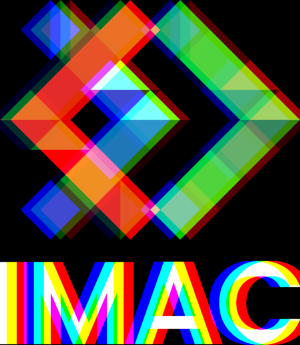

Workshop Prog&Algo

Ex. 1 Ne garder que le vert

Mettre le rouge et le bleu à zéro via image.pixel(x, y).r(&b) = 0.f;

Ex. 2 échanger les canaux

Echanger les couleurs via la commande swap :

std::swap(color.r, color.b);

Ex. 3

Calculer la luminance avec une fonction spécifique (floatluminance = 0.2126 * color.r + 0.7152 * color.g + 0.0722 * color.b;) puis passer toutes les variantes à la valeur de cette luminance.

Ex. 4 Négatif

Prendre toutes les couleurs et les inverser via le spectre soit :

color=1.f-color;

Ex.5 Dégradé

Prendre la taille de l'image et incrémenter le pourcentage en fonction de où on se trouve, soit accorder la couleur en fonction de l'emplacement dans l'image :

    floatpourcentage{taille_actuelle / taille_totale};

    image.pixel(x, y) = pourcentage;

Ex. 6 Miroir

Inverser les pixels en fonction de la taille de l'image. Incrémenter en longueur et largeur puis

std::swap(image.pixel(x, y).r, image.pixel(image.width() - 1 - x, y).r);

Ex. 7 Image bruitée

Prendre la taille de l'image, incrémenter en longueur et largeur et calculer le pourcentage en fonction de la largeur. Mettre les pixels sur la largeur en random.

image.pixel(random_float(0, image.width()), random_float(0, image.height())).r = pourcentage;

Ex. 8 Rotation de 90

Echanger la longueur et la largeur pour la taille de la nouvelle image puis échanger les deux via :

new_image.pixel(image.height() - 1 - y, x)

=image.pixel(x, y);

Ex. 9 RBG split

Mettre des bornes pour pas que le décalage de la couleur ne soit impacté puis décaler la couleur avec

image.pixel(x, y).r = original.pixel(xred, y).r;

Ex. 10 Luminosité

Descendre la puissance de luminance des couleurs via :

image.pixel(x, y).r = pow(image.pixel(x, y).r, 2);

Ex. 11 Disque

Trouver le centre de l'image, définir un radius puis ajouter une condition pour colorer l'image en blanc avec

if (pow(x - x0, 2) + pow(y - y0, 2) <= pow(radius, 2))

Ex. 12 Cercle

Comme le cercle, définir un centre et un radius puis remplir le cercle tout en excluant l'intérieur avec

if (pow(x - x0, 2) + pow(y - y0, 2) <= pow(radius, 2) && pow(x - x0, 2) + pow(y - y0, 2) >= pow(radius, 1.95))

Ex. 13 Animation

Incrémenter le radius et définir de nouvelles images avec

image.save("output/animation"+std::to_string(nb) +".png");

Ex. 14 Rosace

Afficher le cercle puis en définir d'autre ayant pour centre des points du cercle (distance de pi/3)

for (int i= 0; i < 6; i++)

{

    floatxi = x0 + radius * cos(i * (M_PI / 3));

    floatyi = y0 + radius * sin(i * (M_PI / 3));

}

Ex.15 Mosaïque

Diviser l'image en 4 en longueur et en largeur pour définir les points où l'on duplique l'image

intsrc_x = x % width;

intsrc_y = y % height;

img.pixel(x, y) =image.pixel(src_x, src_y);

Ex.16 Mosaïque miroir

Reprendre la mosaïque et intervertir une image sur deux via :

if ((pos_x + pos_y) % 2 == 0)

    {

    src_x = width - 1 - src_x;

    }

Ex.17 Glitch

Définir les rectangles du glitch par rapport à la taille globale de l'image puis définir de manière random de nouveaux rectangles à la place.

Ex.20 Fractale de Mandelbrot

Pour la fractale il faut itérer le nombre complexe z=z*z+c; s'il dépasse un certain nombre, on arrête la spécification car cela n'est pas nécessaire.

Pour la couleur diviser le nombre d'itérations par le nombre max d'itérations afin d'avoir un dégradé de noir et blanc.

Ex.23 Vortex

Pour le vortex, il faut définir le centre de rotation puis incrémenter la distance de rotation de tous les pixels afin qu'ils se décalent en height et width. En fonction de l'angle défini, le cercle est plus ou moins tendu. On change les coordonnées cartésiennes en coordonnées polaires
